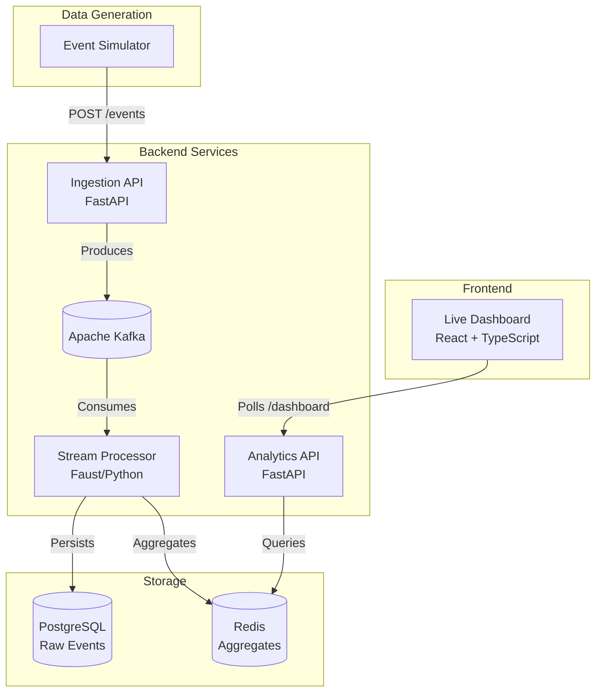

# CartIQ — Real-Time E-Commerce Analytics

CartIQ is a production-grade, event-driven analytics pipeline designed to ingest, process, and visualize e-commerce events in real time. It uses a modern Python and React stack to deliver sub-second insights into revenue, active users, top-selling products, and event breakdowns.

## 🏗️ Architecture



## 🚀 Tech Stack

- **Backend:** Python 3.11, FastAPI
- **Streaming:** Apache Kafka
- **Stream Processing:** `kafka-python` / Faust
- **Database:** PostgreSQL (raw data) + Redis (aggregates)
- **Frontend:** React 19, TypeScript, Vite, TailwindCSS, Recharts
- **Infrastructure:** Docker & Docker Compose

## 🛠️ Quick Start

The entire stack is containerized. To spin up all services (Kafka, Zookeeper, Postgres, Redis, Ingestion, Processor, and Analytics):

```bash
docker-compose up --build
```

### 1. Start the Frontend
In a new terminal:
```bash
cd dashboard
npm install
npm run dev
```

### 2. Generate Live Data
To populate the dashboard with synthetic live events:
```bash
poetry run python scripts/simulate_events.py
```

### 3. View the Dashboard
Open your browser to `http://localhost:5173` to view the live CartIQ dashboard.

## 📊 Features
- **Live KPI Tracking:** Total Revenue, Active Users, Total Orders, and Failed Payments.
- **Dynamic Charts:** Real-time revenue area chart, top-selling products progress bars, and event distribution donut chart.
- **Live Event Feed:** A real-time stream of purchases, cart additions, and payment failures.
