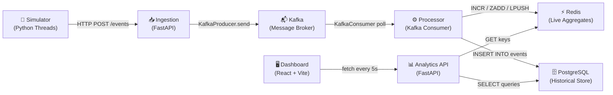
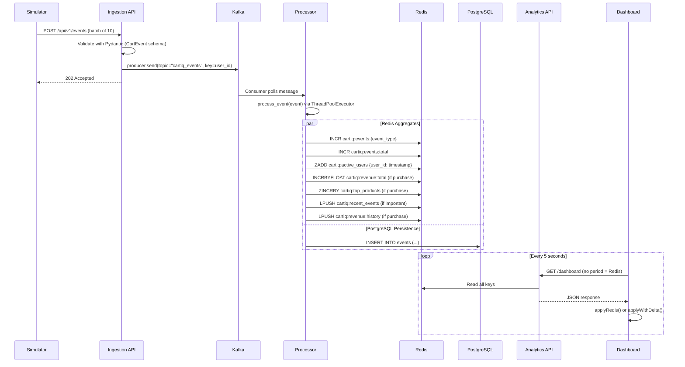
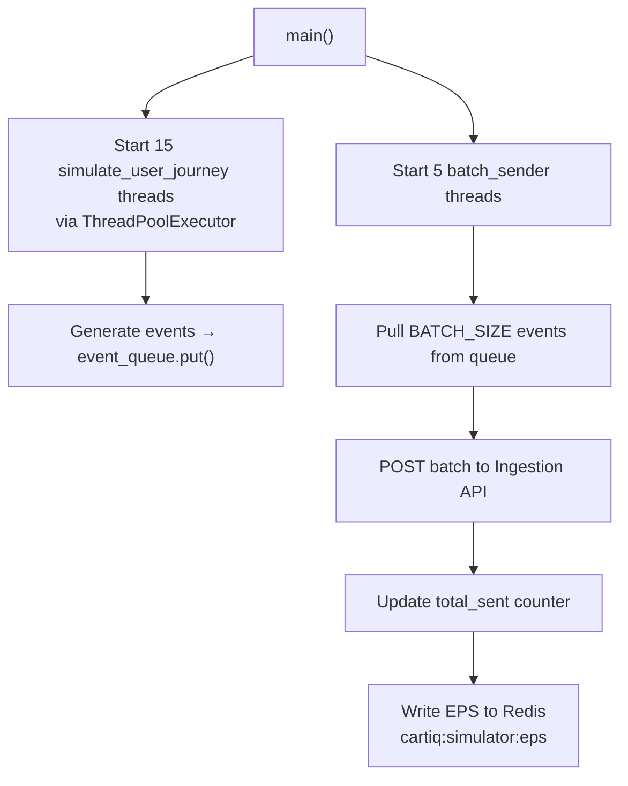
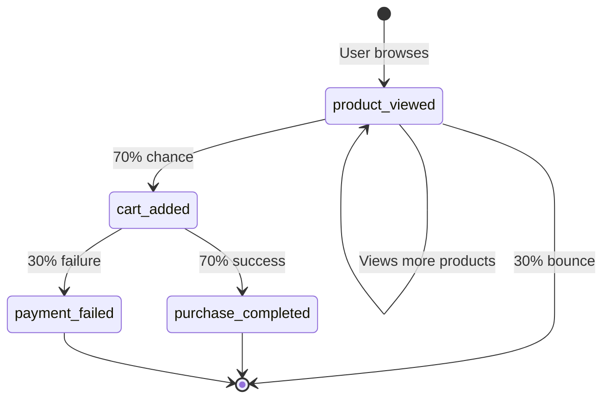
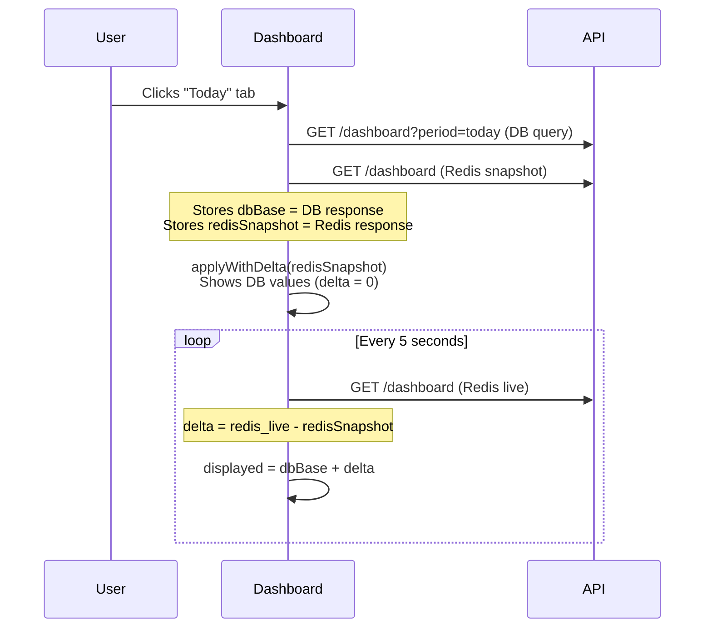

# CartIQ — Codebase Deep Dive

> **A complete technical reference for every event-triggering mechanism, function, data structure, and architectural decision in the CartIQ real-time e-commerce analytics platform.**

---

## Table of Contents

1. [System Architecture Overview](#1-system-architecture-overview)
2. [High-Level Data Flow](#2-high-level-data-flow)
3. [Infrastructure & Docker Compose](#3-infrastructure--docker-compose)
4. [Service 1: Simulator](#4-service-1-simulator)
5. [Service 2: Ingestion](#5-service-2-ingestion)
6. [Service 3: Processor](#6-service-3-processor)
7. [Service 4: Analytics API](#7-service-4-analytics-api)
8. [Service 5: Dashboard (React Frontend)](#8-service-5-dashboard-react-frontend)
9. [Redis Key Reference](#9-redis-key-reference)
10. [PostgreSQL Schema](#10-postgresql-schema)
11. [Event Types & Lifecycle](#11-event-types--lifecycle)
12. [API Endpoint Reference](#12-api-endpoint-reference)
13. [Data Merge Strategy (DB + Redis Delta)](#13-data-merge-strategy-db--redis-delta)

---

## 1. System Architecture Overview

CartIQ is a **real-time e-commerce analytics platform** built using an event-driven microservices architecture. It simulates a high-traffic e-commerce store and processes events through a streaming pipeline to deliver live dashboards.



### Tech Stack

| Layer | Technology | Purpose |
|-------|-----------|---------|
| **Simulator** | Python + `threading` + `ThreadPoolExecutor` | Generate realistic e-commerce event traffic |
| **Ingestion** | FastAPI + `kafka-python` | HTTP → Kafka gateway |
| **Message Broker** | Apache Kafka (Confluent 7.4) | Durable event stream |
| **Processor** | Python + `kafka-python` + `ThreadPoolExecutor` | Consume events, write to Redis + PostgreSQL |
| **Cache** | Redis (Alpine) | Sub-millisecond live aggregates |
| **Database** | PostgreSQL 15 (Alpine) | Persistent historical event storage |
| **Analytics API** | FastAPI + `asyncpg` + `redis-py` | REST API serving dashboard data |
| **Frontend** | React 18 + TypeScript + Vite + Recharts + Framer Motion | Real-time analytics dashboard |

---

## 2. High-Level Data Flow

### The Complete Journey of a Single Event



---

## 3. Infrastructure & Docker Compose

**File:** [`docker-compose.yml`](file:///c:/Users/pc/Desktop/cart_iq/docker-compose.yml)

### Services Defined

| Service | Image | Ports | Role |
|---------|-------|-------|------|
| `zookeeper` | `confluentinc/cp-zookeeper:7.4.0` | 2181 (internal) | Kafka coordination |
| `kafka` | `confluentinc/cp-kafka:7.4.0` | `9092`, `29092` | Event streaming broker |
| `postgres` | `postgres:15-alpine` | `5432` | Persistent event store |
| `redis` | `redis:alpine` | `6379` | Live aggregates cache |
| `ingestion` | Custom build | `8001→8000` | HTTP event receiver |
| `processor` | Custom build | None | Kafka consumer worker |
| `analytics` | Custom build | `8002→8000` | REST API for dashboard |
| `simulator` | Custom build | None | Traffic generator (on-demand via `profiles: [simulator]`) |

### Key Configuration Details

- **Kafka** uses `PLAINTEXT` listener internally (`kafka:9092`) and `PLAINTEXT_HOST` externally (`localhost:29092`).
- **PostgreSQL** credentials: user=`cartiq_user`, password=`cartiq_pass`, database=`cartiq`.
- **Simulator** is gated behind a Docker Compose profile (`profiles: [simulator]`), so it must be started explicitly or via the dashboard UI.
- The `analytics` service mounts `/var/run/docker.sock` to control Docker containers (start/stop simulator, stream logs).

---

## 4. Service 1: Simulator

**Directory:** `apps/simulator/`
**Entry Point:** [`simulate_events.py`](file:///c:/Users/pc/Desktop/cart_iq/apps/simulator/simulate_events.py)

### Purpose

Generates realistic e-commerce event traffic by simulating user journeys (browse → cart → purchase/fail) and sending events in batches to the Ingestion API.

### Architecture



### Functions

#### `make_event(event_type: str, product: dict, user_id: str) → dict`
- **Type:** Pure function (factory)
- **Purpose:** Creates a single event payload with a unique `event_id` (UUID4), stable `product_id` (UUID5), current UTC timestamp, and random quantity (1-3).
- **Returns:** Dictionary matching the `CartEvent` Pydantic schema.

#### `batch_sender()`
- **Type:** Long-running worker (daemon thread)
- **Purpose:** Pulls events from the shared `queue.Queue`, batches them up to `BATCH_SIZE` (10), and sends via `requests.post()` to the Ingestion API.
- **Heartbeat:** Every 100 events, logs the current throughput (EPS) and writes it to Redis key `cartiq:simulator:eps`.
- **Error handling:** Logs failures but never crashes — keeps pulling from the queue.

#### `simulate_user_journey()`
- **Type:** Long-running worker (thread pool task)
- **Purpose:** Simulates one virtual customer in an infinite loop:
  1. **Browse:** Views 2-6 random products (`product_viewed`)
  2. **Cart:** 70% chance to add a product to cart (`cart_added`)
  3. **Checkout:** If carted, 70% chance of `purchase_completed`, 30% chance of `payment_failed`
- **Timing:** Random sleeps between 0.1s-0.5s to simulate realistic browsing behavior.

#### `main()`
- **Type:** Entry point
- **Concurrency:** 5 sender threads + 15 user journey threads = 20 threads total.
- **Product pool:** 100 stable products derived from 20 base product names with generation suffixes.
- **User pool:** 1,000 unique user IDs (`user_0001` to `user_1000`).

### Event Generation Probabilities

```
For each user journey iteration:
├── 2-6 × product_viewed  (100% chance)
├── 1 × cart_added         (70% chance)
│   ├── 1 × purchase_completed  (70% of cart = 49% overall)
│   └── 1 × payment_failed      (30% of cart = 21% overall)
└── sleep 0.2-0.5s
```

---

## 5. Service 2: Ingestion

**Directory:** `apps/ingestion/`
**Entry Point:** [`main.py`](file:///c:/Users/pc/Desktop/cart_iq/apps/ingestion/app/main.py)
**Port:** `8001` (mapped from container port `8000`)

### Purpose

Acts as the HTTP gateway that receives raw e-commerce events, validates them, and publishes them to Kafka. This decouples the event producers from the processing pipeline.

### Files & Functions

---

#### [`config.py`](file:///c:/Users/pc/Desktop/cart_iq/apps/ingestion/app/config.py)

##### `class Settings(BaseSettings)`
- **Type:** Pydantic settings class (auto-loads from `.env`)
- **Fields:**
  - `kafka_bootstrap_servers: str` — Default `"localhost:9092"`
  - `kafka_topic: str` — Default `"cartiq_events"`
  - `debug: bool` — Default `True`

---

#### [`schemas.py`](file:///c:/Users/pc/Desktop/cart_iq/apps/ingestion/app/schemas.py)

##### `class EventType(str, Enum)`
- **Type:** String enum
- **Values:** `product_viewed`, `cart_added`, `cart_removed`, `purchase_completed`, `payment_failed`

##### `class CartEvent(BaseModel)`
- **Type:** Pydantic validation model
- **Fields:**

| Field | Type | Default | Description |
|-------|------|---------|-------------|
| `event_id` | `str` | Auto UUID4 | Unique event identifier |
| `event_type` | `EventType` | Required | One of 5 event types |
| `user_id` | `str` | Required | User who triggered the event |
| `product_id` | `str` | Required | Stable product identifier |
| `product_name` | `str` | Required | Human-readable product name |
| `price` | `float` | Required | Unit price |
| `quantity` | `int` | `1` | Number of items |
| `timestamp` | `datetime` | `utcnow()` | Event timestamp |
| `metadata` | `Optional[dict]` | `{}` | Extra data |

---

#### [`kafka_producer.py`](file:///c:/Users/pc/Desktop/cart_iq/apps/ingestion/app/kafka_producer.py)

##### `json_serializer(obj) → str`
- **Type:** Serialization helper
- **Purpose:** Handles `datetime` objects during JSON serialization by converting to ISO format.

##### `get_producer() → KafkaProducer`
- **Type:** Singleton factory (lazy initialization)
- **Purpose:** Creates and caches a single `KafkaProducer` instance.
- **Configuration:**
  - `value_serializer`: JSON encode + UTF-8
  - `key_serializer`: UTF-8 string (uses `user_id` as key for partition affinity)
  - `acks="all"`: Wait for all in-sync replicas (strongest durability)
  - `retries=3`: Auto-retry on transient failures

##### `async publish_event(event: dict) → bool`
- **Type:** Async function (though Kafka operations are synchronous internally)
- **Purpose:** Sends a single event to the `cartiq_events` Kafka topic.
- **Keying strategy:** Uses `user_id` as the Kafka message key, ensuring all events from the same user go to the same partition (preserving per-user ordering).
- **Returns:** `True` on success, `False` on failure.

---

#### [`routes.py`](file:///c:/Users/pc/Desktop/cart_iq/apps/ingestion/app/routes.py)

##### `POST /api/v1/events` → `ingest_event(event_data: Union[CartEvent, List[CartEvent]])`
- **Type:** FastAPI route handler
- **Accepts:** Single event OR array of events (batch mode)
- **Status code:** `202 Accepted`
- **Logic:**
  1. Normalizes input to a list
  2. Iterates and publishes each event to Kafka via `publish_event()`
  3. Tracks failures
  4. If ALL events fail → raises `500`
  5. Returns `{ status, processed, failed }` summary

##### `GET /api/v1/health`
- **Type:** Health check endpoint
- **Returns:** `{ status: "healthy", service: "ingestion" }`

---

#### [`main.py`](file:///c:/Users/pc/Desktop/cart_iq/apps/ingestion/app/main.py)

##### FastAPI Application Setup
- **Title:** "CartIQ Ingestion Service"
- **Router prefix:** `/api/v1`
- **Lifecycle events:** Logs startup/shutdown

---

## 6. Service 3: Processor

**Directory:** `apps/processor/`
**Entry Point:** [`main.py`](file:///c:/Users/pc/Desktop/cart_iq/apps/processor/app/main.py)
**Port:** None (headless consumer)

### Purpose

The core stream processing engine. Consumes events from Kafka and performs two parallel operations:
1. **Write live aggregates to Redis** (for real-time dashboard)
2. **Persist raw events to PostgreSQL** (for historical queries)

### Files & Functions

---

#### [`config.py`](file:///c:/Users/pc/Desktop/cart_iq/apps/processor/app/config.py)

##### `class Settings(BaseSettings)`
- **Fields:** `kafka_bootstrap_servers`, `kafka_topic`, `redis_host`, `redis_port`, `postgres_host`, `postgres_port`, `postgres_db`, `postgres_user`, `postgres_password`

---

#### [`enums.py`](file:///c:/Users/pc/Desktop/cart_iq/apps/processor/app/enums.py)

##### `class EventType(str, Enum)`
- Same 5 event types as ingestion.

##### `class RedisKey(str, Enum)`
- **Purpose:** Centralized Redis key constants to avoid typos.
- **Keys:**

| Enum Value | Redis Key | Data Type |
|------------|----------|-----------|
| `revenue_total` | `cartiq:revenue:total` | String (float) |
| `top_products` | `cartiq:top_products` | Sorted Set |
| `active_users` | `cartiq:active_users` | Sorted Set |
| `events_total` | `cartiq:events:total` | String (int) |
| `recent_events` | `cartiq:recent_events` | List (JSON) |
| `revenue_history` | `cartiq:revenue:history` | List (JSON) |

---

#### [`models.py`](file:///c:/Users/pc/Desktop/cart_iq/apps/processor/app/models.py)

##### `class Event(Base)` — SQLAlchemy ORM Model
- **Table:** `events`
- **Columns:**

| Column | Type | Constraints | Description |
|--------|------|-------------|-------------|
| `event_id` | `String` | Primary Key | UUID |
| `event_type` | `String` | NOT NULL, Indexed | One of 5 types |
| `user_id` | `String` | NOT NULL, Indexed | User identifier |
| `product_id` | `String` | NOT NULL | Product identifier |
| `product_name` | `String` | NOT NULL | Human-readable name |
| `price` | `Float` | NOT NULL | Unit price |
| `quantity` | `Integer` | NOT NULL, default=1 | Quantity |
| `timestamp` | `DateTime` | Indexed, default=utcnow | Event time |
| `extra_data` | `JSON` | Nullable | Additional metadata |

---

#### [`database.py`](file:///c:/Users/pc/Desktop/cart_iq/apps/processor/app/database.py)

##### `init_db()`
- **Type:** Initialization function
- **Purpose:** Calls `Base.metadata.create_all()` to auto-create the `events` table if it doesn't exist.

##### `get_session() → Session`
- **Type:** Factory function
- **Purpose:** Returns a new SQLAlchemy session from the connection pool.
- **Pool config:** `pool_size=10`, `max_overflow=20` (max 30 concurrent connections).

---

#### [`aggregators.py`](file:///c:/Users/pc/Desktop/cart_iq/apps/processor/app/aggregators.py) — 🔑 Core Processing Logic

This file contains the 6 aggregator functions that are called for every single event. Each function updates a different aspect of the real-time analytics.

##### `update_revenue(event: dict)`
- **Type:** Conditional aggregator (only fires for `purchase_completed`)
- **Redis operations:**
  1. `INCRBYFLOAT cartiq:revenue:total <amount>` — Atomically adds `price × quantity` to the running total.
  2. `LPUSH cartiq:revenue:history <json>` — Pushes a `{name: "HH:MM:SS", revenue: cumulative_total}` JSON object.
  3. `LTRIM cartiq:revenue:history 0 19` — Keeps only the last 20 data points.
- **Why INCRBYFLOAT?** Redis `INCRBYFLOAT` is atomic — safe under concurrent access from multiple threads.

##### `update_top_products(event: dict)`
- **Type:** Conditional aggregator (only fires for `purchase_completed`)
- **Redis operation:** `ZINCRBY cartiq:top_products 1 <product_name>`
- **Data structure:** Redis Sorted Set where the score = purchase count. The `ZREVRANGE` command later retrieves the top 10 by score in O(log N).

##### `update_event_counts(event: dict)`
- **Type:** Universal aggregator (fires for ALL events)
- **Redis operations:**
  1. `INCR cartiq:events:<event_type>` — Per-type counter (e.g., `cartiq:events:product_viewed`)
  2. `INCR cartiq:events:total` — Global event counter

##### `update_active_users(event: dict)`
- **Type:** Universal aggregator (fires for ALL events)
- **Redis operations:**
  1. `ZADD cartiq:active_users {user_id: current_timestamp}` — Adds/updates user in a sorted set with their last-seen timestamp as the score.
  2. `ZREMRANGEBYSCORE cartiq:active_users -inf <5_minutes_ago>` — Evicts users not seen in the last 300 seconds.
- **Sliding window mechanism:** The sorted set naturally maintains a 5-minute sliding window of active users. `ZCARD` gives the count.

##### `track_recent_events(event: dict)`
- **Type:** Selective aggregator (fires for `purchase_completed`, `cart_added`, `payment_failed` only)
- **Purpose:** Maintains a live feed of the 15 most recent "important" events.
- **Logic:** Formats the event into a feed-friendly JSON structure with `id`, `type`, `title`, `subtitle`, `time` fields.
- **Redis operations:**
  1. `LPUSH cartiq:recent_events <json>`
  2. `LTRIM cartiq:recent_events 0 14` — Keeps last 15 events.

##### `save_to_db(event: dict)`
- **Type:** Universal aggregator (fires for ALL events)
- **Purpose:** Persists the raw event to PostgreSQL for historical queries.
- **Error handling:** Catches exceptions, rolls back the session, and logs errors without crashing.

---

#### [`main.py`](file:///c:/Users/pc/Desktop/cart_iq/apps/processor/app/main.py) — Consumer Loop

##### `process_event(event: dict)`
- **Type:** Orchestrator function
- **Purpose:** Calls all 6 aggregators in sequence for a single event:
  ```
  update_event_counts(event)
  update_active_users(event)
  update_revenue(event)
  update_top_products(event)
  track_recent_events(event)
  save_to_db(event)
  ```

##### `create_consumer(retries=10, delay=5) → KafkaConsumer`
- **Type:** Retry-enabled factory
- **Purpose:** Creates a `KafkaConsumer` with retry logic (Kafka may not be ready when the container starts).
- **Consumer config:**
  - `group_id="cartiq-processor"` — Consumer group for offset management
  - `auto_offset_reset="earliest"` — Reads from the beginning on first connect
  - `enable_auto_commit=True` — Offsets are committed automatically
  - `value_deserializer`: JSON decode from bytes

##### `run_consumer()`
- **Type:** Main event loop
- **Purpose:**
  1. Initializes the PostgreSQL database (`init_db()`)
  2. Creates the Kafka consumer
  3. Starts a `ThreadPoolExecutor(max_workers=20)` for concurrent event processing
  4. Enters infinite loop: for each Kafka message, submits `process_event` to the thread pool

---

#### [`agents.py`](file:///c:/Users/pc/Desktop/cart_iq/apps/processor/app/agents.py) — Alternative Faust-based Consumer (Unused)

This file contains an alternative implementation using the **Faust** stream processing library. It defines the same processing logic as `main.py` but using Faust's `@app.agent` decorator pattern. **This file is not currently used in production** — the `main.py` KafkaConsumer approach is the active consumer.

---

## 7. Service 4: Analytics API

**Directory:** `apps/analytics/`
**Entry Point:** [`main.py`](file:///c:/Users/pc/Desktop/cart_iq/apps/analytics/app/main.py)
**Port:** `8002` (mapped from container port `8000`)

### Purpose

The read-only REST API that serves all dashboard data. It reads from both Redis (live data) and PostgreSQL (historical data) depending on the requested time period.

### Files & Functions

---

#### [`main.py`](file:///c:/Users/pc/Desktop/cart_iq/apps/analytics/app/main.py)

- **CORS:** Configured to allow `http://localhost:5173` (Vite dev server).
- **Router prefix:** `/api/v1/analytics`

---

#### [`schemas.py`](file:///c:/Users/pc/Desktop/cart_iq/apps/analytics/app/schemas.py) — Response Models

| Model | Fields | Used By |
|-------|--------|---------|
| `RevenueResponse` | `total_revenue`, `currency` | KPI card |
| `TopProduct` | `product_name`, `purchase_count` | Top products chart |
| `TopProductsResponse` | `products: List[TopProduct]` | Top products chart |
| `EventCountsResponse` | `product_viewed`, `cart_added`, `cart_removed`, `purchase_completed`, `payment_failed`, `total` | KPI cards + pie chart |
| `ActiveUsersResponse` | `active_users`, `window` | KPI card |
| `FeedEvent` | `id`, `type`, `title`, `subtitle`, `time` | Live feed |
| `RevenueHistoryPoint` | `name`, `revenue` | Revenue chart |
| `DashboardResponse` | All of the above combined | Main dashboard endpoint |
| `RedisStats` | `used_memory_human`, `connected_clients`, `total_commands_processed`, `keyspace_hits`, `keyspace_misses`, `hit_ratio`, `total_keys` | Infra page |
| `KafkaTopicStats` | `topic`, `partitions`, `message_count` | Infra page |
| `KafkaStats` | `bootstrap_servers`, `topics`, `consumer_group` | Infra page |
| `InfraResponse` | `redis: RedisStats`, `kafka: KafkaStats` | Infra page |

---

#### [`routes.py`](file:///c:/Users/pc/Desktop/cart_iq/apps/analytics/app/routes.py) — All API Endpoints

##### `GET /revenue` → `get_revenue()`
- **Source:** Redis
- **Logic:** `redis_client.get("cartiq:revenue:total")` → returns float

##### `GET /top-products` → `get_top_products()`
- **Source:** Redis
- **Logic:** `redis_client.zrevrange("cartiq:top_products", 0, 9, withscores=True)` → top 10 products by purchase count (sorted set, descending order)

##### `GET /event-counts` → `get_event_counts()`
- **Source:** Redis
- **Logic:** Reads individual counters `cartiq:events:<type>` for each of the 5 event types, plus `cartiq:events:total`.

##### `GET /active-users` → `get_active_users()`
- **Source:** Redis
- **Logic:**
  1. `ZREMRANGEBYSCORE cartiq:active_users -inf <5min_ago>` — Evict stale users
  2. `ZCARD cartiq:active_users` — Count remaining

##### `get_period_start(period: str) → Optional[datetime]`
- **Type:** Helper function (not an endpoint)
- **Purpose:** Converts period string to a UTC datetime cutoff:

| Period | Returns |
|--------|---------|
| `"today"` | Midnight UTC of current day |
| `"week"` | 7 days ago |
| `"month"` | 30 days ago |
| `"year"` | 365 days ago |
| `"all"` | `None` (no filter) |

##### `get_dashboard_from_postgres(period: str) → DashboardResponse`
- **Type:** Async helper function
- **Source:** PostgreSQL via `asyncpg`
- **Purpose:** Runs 4 SQL queries for the given period:

| Query | Purpose |
|-------|---------|
| `SUM(price * quantity) WHERE event_type='purchase_completed' AND timestamp >= $1` | Total revenue |
| `COUNT(*) ... GROUP BY event_type WHERE timestamp >= $1` | Event counts |
| `COUNT(*) ... WHERE event_type='purchase_completed' GROUP BY product_name ORDER BY cnt DESC LIMIT 10` | Top products |
| `date_trunc('{bucket}', timestamp) ... GROUP BY t ORDER BY t ASC LIMIT {limit}` | Revenue history chart |

- **Bucketing strategy:**

| Period | Bucket | Format | Max Points |
|--------|--------|--------|------------|
| Today | `hour` | `%H:00` | 24 |
| Week | `day` | `%a %d` (e.g. "Mon 19") | 14 |
| Month | `month` | `%b %Y` (e.g. "Jan 2025") | 24 |
| Year | `month` | `%b %Y` | 12 |
| All | `month` | `%b %Y` | 36 |

##### `GET /dashboard?period=<period>` → `get_dashboard(period: Optional[str])`
- **The main endpoint** that powers the entire dashboard.
- **Dual-mode routing:**
  - **With `period` param** (`today`, `week`, `month`, `year`, `all`): → Queries PostgreSQL via `get_dashboard_from_postgres()`
  - **Without `period` param**: → Queries Redis directly (used for live polling and live session mode)

##### `POST /reset` → `reset_dashboard()`
- **Purpose:** Clears all Redis aggregates without touching PostgreSQL.
- **Deletes:** All 6 Redis keys + all 5 per-type event counters.
- **Sets:** `cartiq:reset:timestamp` to current Unix time (for session timer).

##### `GET /session` → `get_session()`
- **Purpose:** Returns the last reset timestamp and elapsed seconds since reset. Used by the frontend to restore the session timer on page refresh.

##### `GET /infra` → `get_infra()`
- **Source:** Redis `INFO` command + Kafka AdminClient
- **Returns:** Memory usage, connected clients, total commands, keyspace hit/miss ratio, topic/partition info.

##### `GET /logs/{service}` → `stream_logs(service: str)`
- **Type:** Server-Sent Events (SSE) streaming endpoint
- **Purpose:** Streams live Docker container logs for Redis or Kafka.
- **Mechanism:** Uses `docker.from_env().containers.get().logs(stream=True, follow=True)` to tail container logs and yields them as SSE `data:` frames.

##### `POST /simulator/start` → `start_simulator()`
- **Purpose:** Starts the simulator Docker container via the Docker SDK.
- **Logic:** Tries to get the container, starts it if stopped, creates it if not found.

##### `POST /simulator/stop` → `stop_simulator()`
- **Purpose:** Stops the simulator Docker container.

##### `GET /simulator/status` → `simulator_status()`
- **Purpose:** Returns whether the simulator is running and its current EPS (read from `cartiq:simulator:eps` Redis key).

---

## 8. Service 5: Dashboard (React Frontend)

**Directory:** `apps/dashboard/`
**Framework:** React 18 + TypeScript + Vite
**Port:** `5173` (Vite dev server)

### Component Tree

```
App.tsx
├── Sidebar.tsx (layout)
├── TopBar.tsx (layout)
│   └── SimulatorControl.tsx (feature)
├── DashboardPage.tsx (feature - main page)
│   ├── KPICards.tsx (feature)
│   ├── ChartsArea.tsx (feature)
│   │   ├── AreaChart (Revenue Over Time)
│   │   ├── Bar Chart (Top Products)
│   │   └── PieChart (Event Breakdown)
│   └── LiveFeed.tsx (feature)
└── InfraPage.tsx (feature - /infra route)
    └── LogTerminal.tsx (feature)
```

### Routing

| Path | Component | Description |
|------|-----------|-------------|
| `/` | `DashboardPage` | Main analytics dashboard |
| `/infra` | `InfraPage` | Infrastructure monitoring |
| `*` | Redirect to `/` | Fallback |

---

### [`DashboardPage.tsx`](file:///c:/Users/pc/Desktop/cart_iq/apps/dashboard/src/features/analytics/DashboardPage.tsx) — The Heart of the Frontend

This is the most complex component. It manages all dashboard state, data fetching, polling, and the dual-mode data merge strategy.

#### State Variables

| State | Type | Purpose |
|-------|------|---------|
| `period` | `Period` | Active time filter (`all`, `today`, `week`, `month`, `year`, `session`) |
| `revenue` | `number` | Total revenue KPI |
| `activeUsers` | `number` | Active users KPI |
| `totalOrders` | `number` | Purchase completed count |
| `failedPayments` | `number` | Payment failed count |
| `totalEvents` | `number` | All events total |
| `revenueHistory` | `RevenueData[]` | Chart data points |
| `topProducts` | `TopProduct[]` | Top selling products |
| `eventData` | `EventData[]` | Pie chart data |
| `feedEvents` | `FeedEvent[]` | Live feed items |
| `sessionSecs` | `number | null` | Session timer seconds |
| `loading` | `boolean` | Initial load state |
| `error` | `string | null` | Error banner |

#### Refs (Persistent across renders)

| Ref | Type | Purpose |
|-----|------|---------|
| `dbBase` | `ApiPayload | null` | Cached PostgreSQL response for the current period |
| `redisSnapshot` | `ApiPayload | null` | Redis values at the moment `dbBase` was fetched |
| `timerRef` | `setInterval | null` | Session timer interval handle |

#### Key Functions

##### `applyRedis(data: ApiPayload)`
- **Used when:** `period === 'session'` (Live Session mode)
- **Logic:** Directly maps Redis API response to all state variables. No database involved.
- **Revenue chart:** Appends each poll's total revenue as a new data point (building a live timeline).

##### `applyWithDelta(redisNow: ApiPayload)`
- **Used when:** Any period except `session`
- **Logic:** The delta-merge algorithm:
  ```
  delta = redis_now_value - redis_snapshot_value
  displayed_value = db_base_value + delta
  ```
- **Why?** Shows historically-accurate DB values that stay live-updated with any new events happening in real time.

##### `fetchBase(p: Period)`
- **Triggers on:** Period change
- **Logic:**
  - **Session mode:** Fetches Redis-only (`/dashboard` no params), clears chart history.
  - **All other modes:** Fetches both DB (`/dashboard?period=<p>`) and Redis (`/dashboard`) simultaneously via `Promise.all()`.

##### `formatTimer(secs: number) → string`
- **Type:** Pure utility
- **Returns:** `HH:MM:SS` formatted string from total seconds.

##### `getLiveLabel(p: Period) → string`
- **Type:** Pure utility
- **Purpose:** Generates contextual X-axis labels for chart data points based on current time and period.

#### Effects (useEffect hooks)

| Effect | Trigger | Purpose |
|--------|---------|---------|
| Session restore | Mount | Fetches `/session` to restore timer if page was refreshed |
| Period change | `period` | Calls `fetchBase()` to load new data |
| Live polling | `period` | Sets up 5-second `setInterval` to poll Redis and update KPIs |

---

### [`KPICards.tsx`](file:///c:/Users/pc/Desktop/cart_iq/apps/dashboard/src/features/analytics/KPICards.tsx)

- **Type:** Presentational component
- **Props:** `revenue`, `activeUsers`, `totalOrders`, `failedPayments`
- **Animation:** Uses Framer Motion `motion.div` with staggered fade-in (0.1s delay per card).
- **Revenue formatting:** `₹${(revenue / 1000).toFixed(1)}k`

---

### [`ChartsArea.tsx`](file:///c:/Users/pc/Desktop/cart_iq/apps/dashboard/src/features/analytics/ChartsArea.tsx)

- **Type:** Presentational component
- **Charts (Recharts library):**
  1. **Revenue AreaChart** — Gradient fill, custom Y-axis formatter (₹k/₹L/₹Cr), responsive X-axis tick intervals per period.
  2. **Top Products Bar Chart** — Horizontal bars with percentage widths relative to the top seller.
  3. **Event Breakdown PieChart** — Donut chart with total events count in the center.

#### X-Axis Configuration by Period

| Period | Tick Interval | Angle | Height |
|--------|--------------|-------|--------|
| Session | Every 3rd | -45° | 60px |
| Today | Every 1 | 0° | 30px |
| Week | Every point | 0° | 30px |
| Month | Every 2 | -30° | 50px |
| Year | Every point | -30° | 50px |
| All | Every 3 | -30° | 50px |

---

### [`LiveFeed.tsx`](file:///c:/Users/pc/Desktop/cart_iq/apps/dashboard/src/features/analytics/LiveFeed.tsx)

- **Type:** Presentational component with animations
- **Props:** `events: FeedEvent[]`
- **Visual differentiation by event type:**

| Type | Background | Icon | Icon Color |
|------|-----------|------|------------|
| `purchase` | emerald | `shopping_bag` | Green |
| `cart` | primary blue | `add_shopping_cart` | Blue |
| `error` | red | `gpp_maybe` | Red |

- **Animation:** Framer Motion `AnimatePresence` for enter/exit transitions.

---

### [`SimulatorControl.tsx`](file:///c:/Users/pc/Desktop/cart_iq/apps/dashboard/src/features/simulator/SimulatorControl.tsx)

- **Type:** Stateful component (polls simulator status)
- **Polling:** Every 2 seconds via `GET /simulator/status`
- **Actions:** Start/Stop toggle via `POST /simulator/start` or `/stop`
- **Display:** Shows live EPS (events per second) when running.

---

### [`InfraPage.tsx`](file:///c:/Users/pc/Desktop/cart_iq/apps/dashboard/src/features/infra/InfraPage.tsx)

- **Polling:** Every 10 seconds via `GET /infra`
- **Redis panel:** Memory, clients, commands, keyspace hit/miss ratio with visual progress bar.
- **Kafka panel:** Bootstrap servers, consumer group, active topics with partition counts.

---

### [`LogTerminal.tsx`](file:///c:/Users/pc/Desktop/cart_iq/apps/dashboard/src/features/infra/LogTerminal.tsx)

- **Type:** SSE consumer component
- **Connection:** `EventSource` to `GET /logs/redis` or `GET /logs/kafka`
- **Features:**
  - Tab switching between Redis and Kafka logs
  - Auto-scroll to bottom
  - Log level color coding (INFO=green, WARNING=yellow, ERROR=red)
  - Clear terminal button
  - Keeps last 200 log lines in memory

---

### [`Sidebar.tsx`](file:///c:/Users/pc/Desktop/cart_iq/apps/dashboard/src/layout/Sidebar.tsx)

- **Navigation:** Dashboard, Infra, Analytics, Orders, Products, Settings
- **Active state:** Uses React Router `NavLink` with `isActive` for highlighting.

### [`TopBar.tsx`](file:///c:/Users/pc/Desktop/cart_iq/apps/dashboard/src/layout/TopBar.tsx)

- **Contains:** CartIQ branding, Live indicator, SimulatorControl, search bar, dark mode / sensors / profile buttons.

---

## 9. Redis Key Reference

| Key | Type | Written By | Read By | TTL |
|-----|------|-----------|---------|-----|
| `cartiq:revenue:total` | String (float) | Processor `update_revenue` | Analytics `get_revenue` | None |
| `cartiq:top_products` | Sorted Set | Processor `update_top_products` | Analytics `get_top_products` | None |
| `cartiq:active_users` | Sorted Set | Processor `update_active_users` | Analytics `get_active_users` | Sliding 5min window |
| `cartiq:events:total` | String (int) | Processor `update_event_counts` | Analytics `get_event_counts` | None |
| `cartiq:events:<type>` | String (int) | Processor `update_event_counts` | Analytics `get_event_counts` | None |
| `cartiq:recent_events` | List (15 max) | Processor `track_recent_events` | Analytics `get_dashboard` | None |
| `cartiq:revenue:history` | List (20 max) | Processor `update_revenue` | Analytics `get_dashboard` | None |
| `cartiq:reset:timestamp` | String (float) | Analytics `reset_dashboard` | Analytics `get_session` | None |
| `cartiq:simulator:eps` | String (float) | Simulator `batch_sender` | Analytics `simulator_status` | None |

---

## 10. PostgreSQL Schema

### `events` Table

```sql
CREATE TABLE events (
    event_id    VARCHAR PRIMARY KEY,
    event_type  VARCHAR NOT NULL,      -- Indexed
    user_id     VARCHAR NOT NULL,      -- Indexed
    product_id  VARCHAR NOT NULL,
    product_name VARCHAR NOT NULL,
    price       FLOAT NOT NULL,
    quantity    INTEGER NOT NULL DEFAULT 1,
    timestamp   TIMESTAMP DEFAULT NOW(), -- Indexed
    extra_data  JSON
);
```

### Indexes
- `ix_events_event_type` on `event_type`
- `ix_events_user_id` on `user_id`
- `ix_events_timestamp` on `timestamp`

---

## 11. Event Types & Lifecycle



| Event Type | Triggers Revenue? | Triggers Top Products? | Triggers Live Feed? | Triggers Active Users? | Triggers Event Count? |
|-----------|:-:|:-:|:-:|:-:|:-:|
| `product_viewed` | ❌ | ❌ | ❌ | ✅ | ✅ |
| `cart_added` | ❌ | ❌ | ✅ | ✅ | ✅ |
| `cart_removed` | ❌ | ❌ | ❌ | ✅ | ✅ |
| `purchase_completed` | ✅ | ✅ | ✅ | ✅ | ✅ |
| `payment_failed` | ❌ | ❌ | ✅ | ✅ | ✅ |

---

## 12. API Endpoint Reference

### Ingestion Service (`localhost:8001`)

| Method | Path | Purpose |
|--------|------|---------|
| `POST` | `/api/v1/events` | Ingest single or batch events |
| `GET` | `/api/v1/health` | Health check |

### Analytics Service (`localhost:8002`)

| Method | Path | Purpose |
|--------|------|---------|
| `GET` | `/api/v1/analytics/dashboard` | Live Redis data (no period) or DB data (with period) |
| `GET` | `/api/v1/analytics/revenue` | Revenue total from Redis |
| `GET` | `/api/v1/analytics/top-products` | Top 10 products from Redis |
| `GET` | `/api/v1/analytics/event-counts` | All event type counts from Redis |
| `GET` | `/api/v1/analytics/active-users` | Active users (5-min window) from Redis |
| `GET` | `/api/v1/analytics/infra` | Redis + Kafka infrastructure stats |
| `GET` | `/api/v1/analytics/session` | Session timer info |
| `GET` | `/api/v1/analytics/logs/{service}` | SSE log stream (redis / kafka) |
| `GET` | `/api/v1/analytics/simulator/status` | Simulator running status + EPS |
| `POST` | `/api/v1/analytics/reset` | Clear all Redis aggregates |
| `POST` | `/api/v1/analytics/simulator/start` | Start simulator container |
| `POST` | `/api/v1/analytics/simulator/stop` | Stop simulator container |
| `GET` | `/api/v1/analytics/health` | Health check |

---

## 13. Data Merge Strategy (DB + Redis Delta)

This is the most sophisticated part of the frontend logic. When viewing a historical period (Today, Week, Month, Year, All), the dashboard uses a **delta-merge** strategy to keep KPIs live-updated without re-querying the database.

### How It Works



### Formula for Each KPI

```
Revenue     = db.revenue.total_revenue     + (redis_now.revenue.total_revenue     - redis_snapshot.revenue.total_revenue)
Total Orders = db.event_counts.purchase_completed + (redis_now.event_counts.purchase_completed - redis_snapshot.event_counts.purchase_completed)
Failed       = db.event_counts.payment_failed    + (redis_now.event_counts.payment_failed    - redis_snapshot.event_counts.payment_failed)
Total Events = db.event_counts.total             + (redis_now.event_counts.total             - redis_snapshot.event_counts.total)
Active Users = redis_now.active_users.active_users  (always live, no delta)
```

### Why This Pattern?

- **PostgreSQL** holds the authoritative historical data but is too slow to query every 5 seconds.
- **Redis** holds live running totals but doesn't know about time-period filtering.
- By capturing a Redis "snapshot" at the same moment we query the DB, any subsequent Redis changes represent **new events** that happened after the DB query. Adding this delta to the DB base gives us historically-accurate values that stay live.

---

> *This document was generated by analyzing every source file in the CartIQ repository. Last updated: May 25, 2026.*
